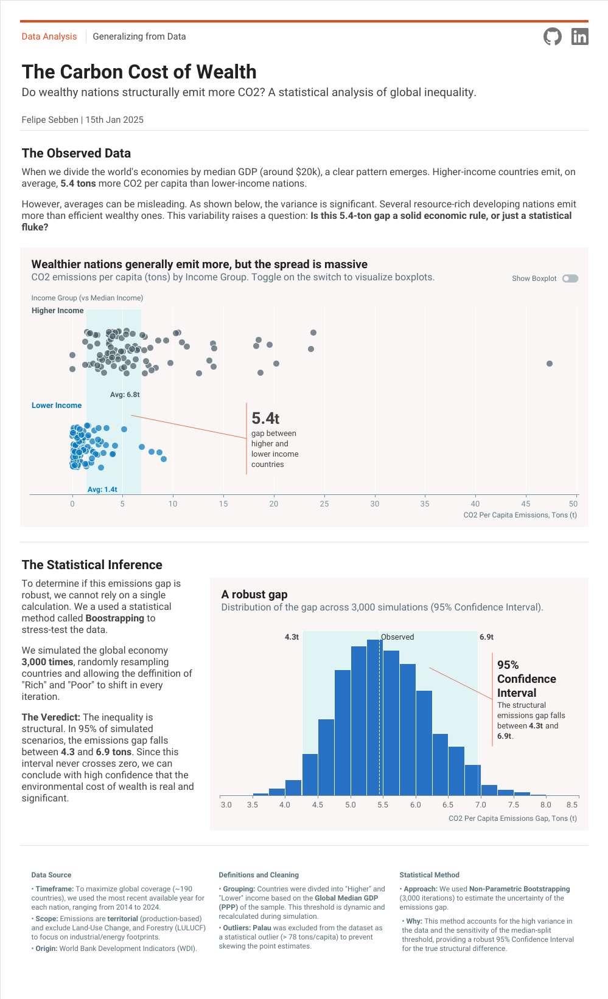

# The Carbon Cost of Wealth
### Do wealthy nations structurally emit more CO2? A statistical analysis of global inequality.

<figure>

 
<figcaption><i>Final Report in Tableau Public. <a href="https://public.tableau.com/app/profile/felipe.sebben/viz/GeneralizingfromDataCO2PerCapitaEmissions/DataAnalysisGeneralizingfromData?publish=yes"> Click here to explore the interactive version on Tableau Public</a>.</i></figcaption>
</figure>
---

## Overview

When we divide the world's economies by income, a clear pattern emerges: higher-income nations emit significantly more CO2 per capita than lower-income nations. However, averages can be misleading. The variance within these groups is massive—some developing resource-rich nations pollute far more than efficient wealthy ones.

**The Goal:** To move beyond simple averages and statistically "stress-test" this inequality. Is the observed emissions gap a solid economic rule, or is it a statistical accident driven by outliers?

This project combines **Python** for robust statistical simulation (Bootstrapping) and **Tableau** for editorial-style visualization to answer that question.

## Main Findings

* **The Signal:** On average, higher-income nations emit **5.44 tons** more CO2 per capita than lower-income nations.
* **The Verification:** Using a Bootstrap Simulation (3,000 iterations), we found that this gap is structural. In 95% of simulated scenarios, the gap remains strictly positive, falling between **4.3t and 6.9t**.
* **The Verdict:** Wealth is a consistent, structural driver of higher per capita emissions, regardless of how we slice the data.

## Repository Structure

This repository contains the full end-to-end workflow, from raw data processing to statistical validation.

| File/Folder | Description |
| :--- | :--- |
| **`05-WDI_CO2_GDP.ipynb`** | The core analytical engine. Contains the EDA, and the full Bootstrap simulation logic. |
| **`05-WDI_CO2_GDP_prep.py`** | The ETL script. Handles cleaning of World Bank data, outlier removal (e.g., Palau), and feature engineering. |
| **`tableau/`** | Contains the design assets and reference images for the "Visual Paper" layout. |
| **`data/`** | Processed datasets used for the Tableau visualization. |

## Methodology & Data

* **Source:** World Bank Development Indicators (WDI).
* **Scope:** Analysis uses the most recent available year for each country (ranging 2019–2024) to maximize global coverage (~180 nations).
* **Metrics:** Emissions are **territorial** (production-based) and exclude Land-Use Change (LULUCF).
* **Definitions:** "Higher" vs. "Lower" income groups are defined dynamically by the global median GDP (PPP) of the sample.

---

### Author

**Felipe Sebben**
* [LinkedIn](www.linkedin.com/in/felipe-sebben)
* [Tableau Public Portfolio](https://public.tableau.com/app/profile/felipe.sebben/vizzes)
